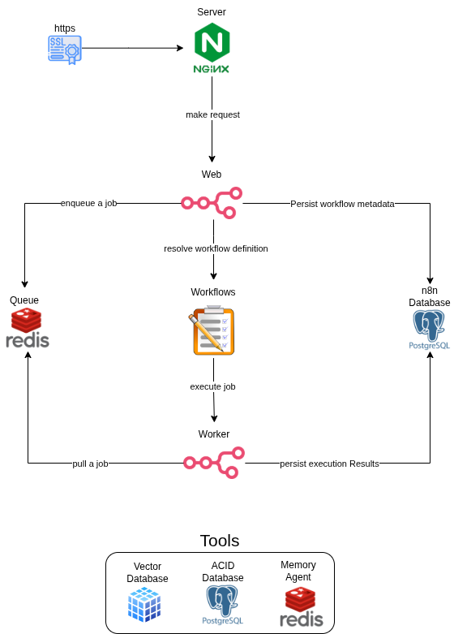

# n8n Docker Infrastructure

Bem-vindo ao repositório de infraestrutura do n8n utilizando Docker. Este projeto foi projetado para fornecer um ambiente robusto, escalável e fácil de gerenciar para automação de fluxos de trabalho e agentes de IA, utilizando as melhores práticas de containerização.



## 📋 Sobre o Projeto

Este projeto orquestra uma infraestrutura completa para o n8n em modo de fila (queue mode), garantindo alta disponibilidade e separação de responsabilidades. Além do núcleo do n8n, a stack inclui serviços dedicados para suporte a agentes de IA e ferramentas de gerenciamento de banco de dados.

O objetivo é permitir que desenvolvedores e engenheiros de dados subam um ambiente de automação profissional em minutos, independentemente do sistema operacional.

## 🚀 Tecnologias e Serviços Utilizados

A infraestrutura é construída sobre uma stack moderna e confiável:

*   **[Docker](https://www.docker.com/) & [Docker Compose](https://docs.docker.com/compose/):** Para orquestração e isolamento dos serviços.
*   **[n8n](https://n8n.io/):** Plataforma de automação de fluxo de trabalho (versão principal e workers).
*   **[PostgreSQL](https://www.postgresql.org/):**
    *   Banco de dados principal do n8n (`database`).
    *   Banco de dados dedicado para ferramentas/agentes de IA (`database-tool`).
*   **[Redis](https://redis.io/):**
    *   Gerenciamento de filas de tarefas do n8n (`queue`).
    *   Memória rápida para agentes de IA (`memory`).
*   **[pgAdmin 4](https://www.pgadmin.org/):** Interface web para administração facilitada do banco de dados de ferramentas.

---

## 🛠️ Pré-requisitos

Antes de começar, certifique-se de ter as ferramentas abaixo instaladas em sua máquina.

### 1. Git
Necessário para clonar o repositório.
*   [Download Git](https://git-scm.com/downloads)

### 2. Docker
O motor principal para rodar a infraestrutura. Recomendamos sempre a **última versão estável**.

*   **Windows:** [Docker Desktop para Windows](https://docs.docker.com/desktop/install/windows-install/) (Recomendado usar com WSL2).
*   **Mac:** [Docker Desktop para Mac](https://docs.docker.com/desktop/install/mac-install/) (Suporte a Apple Silicon e Intel).
*   **Linux:** [Docker Engine](https://docs.docker.com/engine/install/) e [Docker Compose Plugin](https://docs.docker.com/compose/install/linux/).

---

## 📦 Como Rodar o Projeto (Passo a Passo)

Siga este guia para colocar sua infraestrutura no ar.

### Passo 1: Clonar o Repositório

Abra seu terminal e clone este projeto para sua máquina local:

```bash
git clone https://github.com/seu-usuario/n8n-docker-infra.git
cd n8n-docker-infra
```

### Passo 2: Configurar Variáveis de Ambiente

O projeto utiliza um arquivo `.env` para gerenciar senhas e configurações sensíveis. Criamos um modelo para você começar.

1.  Copie o arquivo de exemplo:
    ```bash
    cp .env-example .env
    # No Windows (PowerShell), use: copy .env-example .env
    ```

2.  Abra o arquivo `.env` em seu editor de texto preferido e ajuste as variáveis se necessário.
    *   **Importante:** Gere uma chave de criptografia segura para a variável `N8N_ENCRYPTION_KEY`.
    *   Para gerar uma chave, você pode rodar no terminal (Linux/Mac/WSL):
        ```bash
        openssl rand -base64 32
        ```

### Passo 3: Inicializar os Serviços

Com tudo configurado, suba os containers. O Docker baixará as imagens e iniciará os serviços.

```bash
docker compose up -d
```

*   O parâmetro `-d` (detached) roda os containers em segundo plano.

### Passo 4: Verificar o Status

Aguarde alguns instantes para que todos os serviços inicializem (o banco de dados e o n8n podem levar alguns segundos). Verifique se tudo está rodando:

```bash
docker compose ps
```

---

## 🌍 Acessando os Serviços

Após a inicialização, você pode acessar as interfaces web através do seu navegador:

| Serviço | URL | Credenciais Padrão (se não alteradas no .env) |
| :--- | :--- | :--- |
| **n8n Editor** | `http://localhost:5678` | Crie sua conta no primeiro acesso. |
| **pgAdmin** | `http://localhost:5050` | **Email:** `admin@local` <br> **Senha:** `pgadminpass` |

---

## 💻 Guia Específico por Sistema Operacional

### 🍎 macOS
1.  Instale o Docker Desktop para Mac.
2.  Abra o Terminal.
3.  Siga os [Passos 1 a 3](#passo-1-clonar-o-repositório) acima.
4.  O acesso ao `localhost` funciona nativamente.

### 🪟 Windows
1.  Instale o Docker Desktop para Windows.
2.  Habilite a integração com **WSL 2** (Windows Subsystem for Linux) nas configurações do Docker para melhor performance.
3.  Use o **PowerShell** ou um terminal WSL (como Ubuntu) para rodar os comandos.
4.  Comando para copiar o .env no PowerShell: `copy .env-example .env`.
5.  Siga os demais passos normalmente.

### 🐧 Linux (Ubuntu/Debian)
1.  Instale o Docker Engine e o plugin Docker Compose.
2.  Adicione seu usuário ao grupo docker para rodar sem `sudo` (opcional, mas recomendado):
    ```bash
    sudo usermod -aG docker $USER
    newgrp docker
    ```
3.  Siga os [Passos 1 a 3](#passo-1-clonar-o-repositório) acima.

---

## 🧹 Comandos Úteis

*   **Parar a infraestrutura:**
    ```bash
    docker compose down
    ```
*   **Ver logs em tempo real (ex: do n8n):**
    ```bash
    docker compose logs -f n8n
    ```
*   **Atualizar as imagens:**
    ```bash
    docker compose pull
    docker compose up -d
    ```

---

## 📞 Suporte

Se encontrar problemas ou tiver dúvidas sobre a infraestrutura, sinta-se à vontade para abrir uma *issue* neste repositório.

